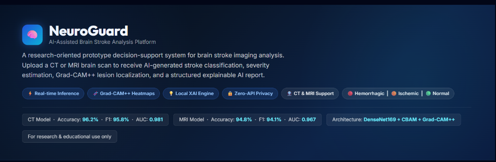
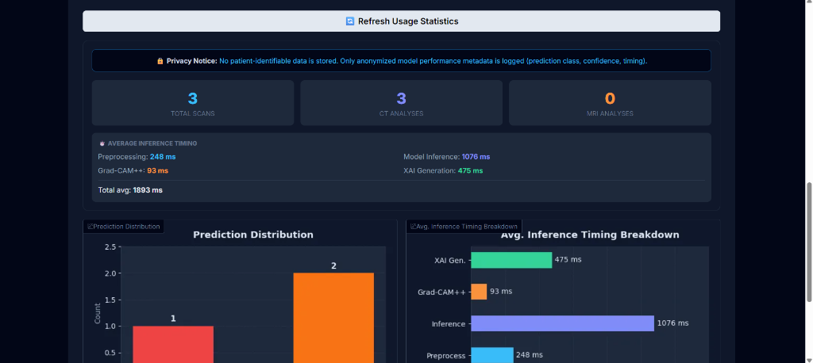

# NeuroGuard 🧠 — AI-Assisted Brain Stroke Analysis Platform

A research-oriented prototype decision-support platform for brain stroke imaging analysis (CT & MRI). NeuroGuard integrates deep learning classification with attention mechanisms, Grad-CAM++ localization, spatial analysis, and a local explainable AI (XAI) reporting engine.

### 🌐 Live Demos
*   **Production Standalone Site:** [neuroguard-ai.netlify.app](https://neuroguardai.netlify.app/) (Free Custom Domain)
*   **Hugging Face Spaces Embed:** [jaswanth69-neuroguard.hf.space](https://jaswanth69-neuroguard.hf.space)

---

## 📷 Screenshots

### 🩻 Main Dashboard & XAI Report


### 📊 Real-Time Analytics Dashboard


---

## 🛠️ Key Features

1.  **Multi-Modality Diagnostics:** Dual pipelines supporting **Computed Tomography (CT)** and **Magnetic Resonance Imaging (MRI)** scans.
2.  **CBAM Attention Mechanism:** Incorporates Convolutional Block Attention Modules (CBAM) to focus on relevant spatial and channel-wise imaging features.
3.  **Grad-CAM++ Localization:** Highlights approximate lesion zones with high-resolution visual heatmaps.
4.  **Calibrated Confidence:** Calibrates confidence scores into four clinical tiers:
    *   `Highly Confident` (>90%)
    *   `Moderately Confident` (75–90%)
    *   `Low Confidence` (60–75%) — *recommends radiologist review*
    *   `Non-Diagnostic` (<60%) — *triggers clinical uncertainty warnings*
5.  **Local XAI Engine:** A fully local rule-based Natural Language Processing (NLP) system that generates structured clinical interpretations based on spatial activation and confidence calibration without relying on any external APIs.
6.  **Anonymized Analytics:** Logs inference times, prediction classes, and confidence scores locally into a SQLite database, generating real-time charts in the dashboard.

---

## 🏗️ Technical Pipeline
```
Input Scan → Pre-Inference Validation Layer → DenseNet169 + CBAM →
Grad-CAM++ Activation → Spatial Area Analytics → Local XAI Engine →
Metadata DB Logger → Gradio 5.x Web Dashboard
```

---

## 🚀 Local Installation & Run

### Prerequisites
*   Python 3.10.x (Recommended)
*   Git

### Step-by-Step Setup

1.  **Clone the Repository:**
    ```bash
    git clone https://github.com/YOUR_GITHUB_USERNAME/neuroguard.git
    cd neuroguard
    ```

2.  **Install Dependencies:**
    ```bash
    pip install -r requirements.txt
    ```

3.  **Place the Models:**
    Download your model checkpoints (`ct_best_model.pth` and `mri_best_model_v2.pth`) and place them in the `Models/` directory:
    ```
    Models/ct_best_model.pth
    Models/mri_best_model_v2.pth
    ```

4.  **Run the App:**
    ```bash
    python app.py
    ```
    Open `http://localhost:7860` in your web browser.

---

## ⚙️ Technologies Used
*   **Core:** Python 3.10, PyTorch 2.x, Torchvision
*   **Web Framework:** Gradio 5.x (compatible with 4.x/6.x), FastAPI, Uvicorn
*   **Computer Vision:** OpenCV, Pillow, SciPy
*   **Logger & Analytics:** SQLite3, Matplotlib

---

## ⚠️ Academic & Clinical Disclaimer
This platform is a **research prototype** and is intended for **educational demonstration and academic research purposes only**. It has not been FDA-cleared, CE-marked, or validated in multi-center clinical trials. It must **not** be used for patient diagnosis, treatment planning, or clinical decision-making. All outputs require verification by a qualified radiologist or neurologist.
